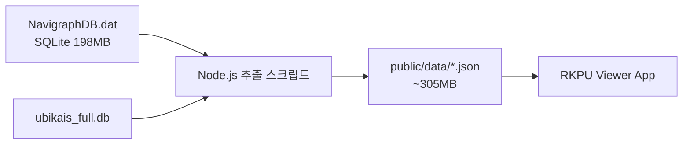
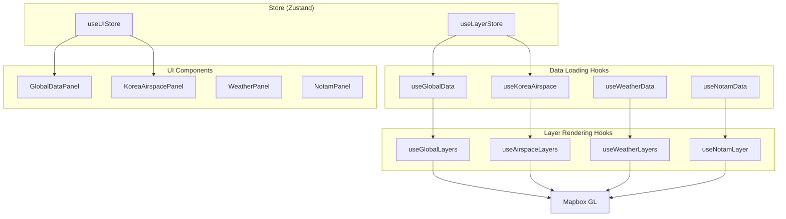

# RKPU-Viewer 데이터 아키텍처

## 1. 데이터 소스 개요

### 1.1 원본 데이터베이스

| 소스 | 형식 | 크기 | 설명 |
|------|------|------|------|
| NavigraphDB.dat | SQLite | 198 MB | Jeppesen AIRAC 2601 항공 데이터 |
| ubikais_full.db | SQLite | - | 국토부 Ubikais 데이터 (절차 정보) |

### 1.2 데이터 추출 과정



---

## 2. 정적 데이터 파일 (public/data/)

### 2.1 전세계 항공 데이터 (Navigraph AIRAC 2601)

| 파일명 | 크기 | 레코드 수 | 소스 테이블 | 설명 |
|--------|------|-----------|-------------|------|
| `global_airports.json` | 4.1 MB | ~13,000 | tbl_airports | 전세계 공항 정보 |
| `global_airways.json` | 8.2 MB | ~8,000 | tbl_enroute_airways | 항공로 (ATS 경로) |
| `global_waypoints.json` | 10.4 MB | ~195,000 | tbl_enroute_waypoints | 항법 웨이포인트 |
| `global_navaids.json` | 2.3 MB | ~18,000 | tbl_enroute_navaids | VOR/DME/NDB 등 |
| `global_heliports.json` | 1.8 MB | ~14,500 | tbl_heliports | 헬리포트 |
| `global_holdings.json` | 1.6 MB | ~14,800 | tbl_holdings | 홀딩 패턴 |
| `global_ctrl_airspace.json` | 7.9 MB | ~8,600 | tbl_controlled_airspace | 관제 공역 (CTR/TMA) |
| `global_restr_airspace.json` | 7.9 MB | ~28,400 | tbl_restrictive_airspace | 제한/금지 공역 (P/R/D) |
| `global_fir_uir.json` | 1.5 MB | ~700 | tbl_fir_uir | FIR/UIR 경계 |
| `global_airway_restrictions.json` | 51 KB | - | tbl_enroute_airway_restriction | 항공로 제한 |
| `global_cruising_tables.json` | 65 KB | - | tbl_cruising_tables | 순항 고도 테이블 |
| `global_enroute_comms.json` | 1.8 MB | - | tbl_enroute_comms | 항로상 통신 주파수 |
| `global_gls.json` | 63 KB | - | tbl_gls | GLS 접근 정보 |
| `global_grid_mora.json` | 792 KB | - | tbl_grid_mora | 격자 최저안전고도 |
| `global_pathpoints.json` | 2.2 MB | - | tbl_pathpoints | 경로점 |
| `global_gates.json` | 6.1 MB | 57,247 | tbl_pb_gates | 공항 게이트/주기장 |
| `global_runways.json` | 11.1 MB | 38,649 | tbl_pg_runways | 활주로 정보 |
| `global_ils.json` | 1.3 MB | 4,397 | tbl_pi_localizers_glideslopes | ILS/LOC/GS |
| `global_markers.json` | 0.15 MB | 938 | tbl_pm_localizer_marker | OM/MM/IM 마커 |
| `global_msa.json` | 4.8 MB | 14,918 | tbl_ps_airport_msa | 최저섹터고도 (MSA) |
| `global_terminal_waypoints.json` | 23.2 MB | 165,405 | tbl_pc_terminal_waypoints | 터미널 웨이포인트 |
| `global_airport_comms.json` | 10.0 MB | 53,620 | tbl_pv_airport_communication | 공항 통신 주파수 |
| `global_terminal_ndbs.json` | 0.14 MB | 901 | tbl_pn_terminal_ndbnavaids | 터미널 NDB |
| `global_sids.json` | 52.0 MB | 213,739 | tbl_pd_sids | 전세계 SID 절차 |
| `global_stars.json` | 41.8 MB | 170,879 | tbl_pe_stars | 전세계 STAR 절차 |
| `global_iaps.json` | 98.9 MB | 380,326 | tbl_pf_iaps | 전세계 접근 절차 (IAP) |

### 2.2 헬리포트 절차 데이터

| 파일명 | 크기 | 레코드 수 | 소스 테이블 | 설명 |
|--------|------|-----------|-------------|------|
| `global_heliport_sids.json` | 0.8 MB | 4,421 | tbl_hd_sids | 헬리포트 SID |
| `global_heliport_stars.json` | 0.04 MB | 218 | tbl_he_stars | 헬리포트 STAR |
| `global_heliport_iaps.json` | 1.9 MB | 10,751 | tbl_hf_iaps | 헬리포트 접근 절차 |
| `global_heliport_waypoints.json` | 0.6 MB | 5,203 | tbl_hc_terminal_waypoints | 헬리포트 터미널 웨이포인트 |
| `global_heliport_comms.json` | 0.4 MB | 2,663 | tbl_hv_airport_communication | 헬리포트 통신 주파수 |

### 2.3 한국 특화 데이터

| 파일명 | 크기 | 소스 | 설명 |
|--------|------|------|------|
| `korea_airspace.json` | 1.4 MB | NavigraphDB | 한국 공역 (ACC/TMA/CTR) |
| `korea_procedures.json` | 928 KB | ubikais_full.db | SID/STAR/Approach 절차 |

### 2.3 실시간/동적 데이터

| 파일명 | 크기 | 소스 | 갱신 주기 |
|--------|------|------|-----------|
| `notams.json` | 727 KB | 국토부 Ubikais 크롤링 | 수동/일간 |
| `weather.json` | 680 B | KMA/AWC API | 실시간 |

---

## 3. 데이터 스키마

### 3.1 global_airports.json

```typescript
interface Airport {
  airport_identifier: string;    // ICAO 코드 (예: RKSI)
  airport_name: string;          // 공항명
  latitude: number;              // 위도
  longitude: number;             // 경도
  elevation: number;             // 표고 (ft)
  transition_altitude?: number;  // 전이 고도
  transition_level?: number;     // 전이 레벨
  speed_limit?: number;          // 속도 제한
  speed_limit_altitude?: number; // 속도 제한 고도
  iata_ata_designator?: string;  // IATA 코드
  icao_code: string;             // ICAO 지역 코드
  airport_3letter?: string;      // 3문자 코드
  ifr_capability?: string;       // IFR 가능 여부
  longest_runway?: number;       // 최장 활주로 길이
  magnetic_variation?: number;   // 자기 편차
  datum_code?: string;           // 측지 기준
  area_code: string;             // 지역 코드
}
```

### 3.2 global_airways.json

```typescript
interface Airway {
  route_identifier: string;      // 항공로 ID (예: A1, G597)
  route_type: string;            // 유형 (J=Jet, V=Victor)
  sequence_number: number;       // 순서
  fix_identifier: string;        // 픽스/웨이포인트
  fix_latitude: number;          // 위도
  fix_longitude: number;         // 경도
  waypoint_description_code?: string;  // 웨이포인트 설명
  outbound_course?: number;      // 출발 방위
  route_distance_from?: number;  // 거리
  inbound_magnetic_course?: number;  // 도착 방위
  minimum_altitude?: number;     // 최저 고도
  maximum_altitude?: number;     // 최고 고도
  direction_restriction?: string;  // 방향 제한
  cruise_table_indicator?: string; // 순항 테이블
  area_code: string;
  icao_code: string;
}
```

### 3.3 global_waypoints.json

```typescript
interface Waypoint {
  waypoint_identifier: string;   // 식별자 (5자리)
  latitude: number;
  longitude: number;
  waypoint_type: string;         // 유형
  waypoint_usage?: string;       // 사용처
  waypoint_name_description?: string;  // 설명
  magnetic_variation?: number;
  datum_code?: string;
  area_code: string;
  icao_code: string;
}
```

### 3.4 global_navaids.json

```typescript
interface Navaid {
  navaid_identifier: string;     // VOR/DME/NDB ID
  navaid_name: string;           // 명칭
  navaid_type: string;           // VOR, VORDME, NDB, DME, etc.
  latitude: number;
  longitude: number;
  frequency?: number;            // 주파수 (kHz/MHz)
  channel?: string;              // DME 채널
  elevation?: number;            // 표고
  magnetic_variation?: number;
  range?: number;                // 유효 범위
  area_code: string;
  icao_code: string;
}
```

### 3.5 공역 데이터 (ctrl/restr/fir_uir)

```typescript
interface Airspace {
  airspace_center: string;       // 중심점 식별자
  airspace_type: string;         // A, C, D, P, R, D, FIR, UIR 등
  airspace_name: string;         // 공역명
  boundary_via: string;          // 경계 정의 방법
  latitude: number;
  longitude: number;
  sequence_number: number;
  lower_limit?: string;          // 하한 (GND, FL, etc.)
  lower_unit?: string;
  upper_limit?: string;          // 상한
  upper_unit?: string;
  restrictive_type?: string;     // P(prohibited), R(restricted), D(danger)
  area_code: string;
  icao_code: string;
}
```

### 3.6 global_holdings.json

```typescript
interface Holding {
  fix_identifier: string;        // 홀딩 픽스
  latitude: number;
  longitude: number;
  inbound_course: number;        // 인바운드 코스
  turn_direction: string;        // L/R
  leg_length?: number;           // 레그 길이
  leg_time?: number;             // 레그 시간
  minimum_altitude?: number;
  maximum_altitude?: number;
  speed?: number;                // 속도 제한
  area_code: string;
  icao_code: string;
}
```

### 3.7 global_gates.json

```typescript
interface Gate {
  airport_identifier: string;   // ICAO 공항 코드
  gate_identifier: string;      // 게이트 번호
  lat: number;                  // 위도
  lon: number;                  // 경도
  name?: string;                // 게이트명
}
```

### 3.8 global_runways.json

```typescript
interface Runway {
  airport_identifier: string;   // ICAO 공항 코드
  runway_identifier: string;    // 활주로 ID (예: 33L)
  lat: number;                  // 진입점 위도
  lon: number;                  // 진입점 경도
  runway_length: number;        // 길이 (ft)
  runway_width: number;         // 폭 (ft)
  heading: number;              // 자기 방위각
  runway_true_bearing?: number; // 진 방위각
  elevation?: number;           // 표고 (ft)
  displaced_threshold_distance?: number;  // 이설 임계치
  llz_identifier?: string;      // ILS 로컬라이저 ID
  surface_code?: string;        // 표면 코드
  runway_gradient?: number;     // 경사도
}
```

### 3.9 global_ils.json

```typescript
interface ILS {
  airport_identifier: string;   // ICAO 공항 코드
  runway_identifier: string;    // 활주로 ID
  llz_identifier: string;       // 로컬라이저 ID
  llz_frequency: number;        // 주파수 (MHz)
  loc_lat: number;              // 로컬라이저 위도
  loc_lon: number;              // 로컬라이저 경도
  llz_bearing: number;          // 로컬라이저 방위
  llz_width?: number;           // 빔 폭
  gs_lat?: number;              // 글라이드슬로프 위도
  gs_lon?: number;              // 글라이드슬로프 경도
  gs_angle?: number;            // 글라이드슬로프 각도 (일반적으로 3°)
  gs_elevation?: number;        // 글라이드슬로프 표고
  category?: string;            // ILS 카테고리 (CAT I/II/III)
  station_declination?: number; // 편차
}
```

### 3.10 global_msa.json

```typescript
interface MSA {
  airport_identifier: string;   // ICAO 공항 코드
  msa_center: string;           // MSA 중심 식별자
  radius_limit: number;         // 반경 (NM)
  sector_bearing_1?: number;    // 섹터 1 시작 방위
  sector_altitude_1?: number;   // 섹터 1 최저고도 (ft)
  sector_bearing_2?: number;    // 섹터 2 시작 방위
  sector_altitude_2?: number;   // 섹터 2 최저고도
  // ... 최대 5개 섹터
  magnetic_true_indicator?: string; // M/T
}
```

### 3.11 global_sids/stars/iaps.json (절차 데이터)

```typescript
interface Procedure {
  apt: string;                  // 공항 ICAO
  proc: string;                 // 절차명 (예: OLMEN1A)
  trans: string;                // 트랜지션
  route_type: string;           // 경로 유형
  seqno: number;                // 순서 번호
  wpt: string;                  // 웨이포인트 식별자
  path_term: string;            // Path Termination (IF, TF, CF, DF, etc.)
  course?: number;              // 코스
  distance_time?: number;       // 거리/시간
  alt_desc?: string;            // 고도 제한 설명 (+, -, B, etc.)
  altitude1?: number;           // 고도1
  altitude2?: number;           // 고도2
  spd_desc?: string;            // 속도 제한 설명
  spd?: number;                 // 속도 제한 (kt)
  turn?: string;                // 선회 방향 (L/R)
  arc_radius?: number;          // Arc 반경
  rnp?: number;                 // RNP 값
  vertical_angle?: number;      // 수직 각도 (IAP only)
}
```

### 3.12 global_airport_comms.json

```typescript
interface AirportComm {
  airport_identifier: string;   // ICAO 공항 코드
  type: string;                 // 통신 유형 (TWR, GND, APP, DEP, etc.)
  freq: number;                 // 주파수 (MHz)
  callsign?: string;            // 콜사인
  frequency_units?: string;     // 주파수 단위
  service_indicator?: string;   // 서비스 구분
  sectorization?: string;       // 섹터화 정보
  lat?: number;                 // 위도
  lon?: number;                 // 경도
}
```

### 3.13 korea_procedures.json

```typescript
interface Procedure {
  airport: string;               // ICAO 공항 코드
  type: 'SID' | 'STAR' | 'APPROACH';
  name: string;                  // 절차명
  runway: string;                // 활주로
  points: ProcedurePoint[];
}

interface ProcedurePoint {
  name: string;                  // 웨이포인트명
  latitude: number;
  longitude: number;
  altitude?: string;             // 고도 제한
  speed?: string;                // 속도 제한
  type: string;                  // IF, TF, CF, DF 등
}
```

---

## 4. 데이터 로딩 및 사용

### 4.1 Hook - Store - Layer 매핑



### 4.2 데이터 유형별 로딩 훅

| 데이터 | 로딩 Hook | 렌더링 Hook | UI Panel |
|--------|-----------|-------------|----------|
| 전세계 공항 | `useGlobalData` | `useGlobalLayers` | `GlobalDataPanel` |
| 전세계 항공로 | `useGlobalData` | `useGlobalLayers` | `GlobalDataPanel` |
| 전세계 웨이포인트 | `useGlobalData` | `useGlobalLayers` | `GlobalDataPanel` |
| 전세계 항법시설 | `useGlobalData` | `useGlobalLayers` | `GlobalDataPanel` |
| 전세계 헬리포트 | `useGlobalData` | `useGlobalLayers` | `GlobalDataPanel` |
| 전세계 홀딩 | `useGlobalData` | `useGlobalLayers` | `GlobalDataPanel` |
| 전세계 관제공역 | `useGlobalData` | `useGlobalLayers` | `GlobalDataPanel` |
| 전세계 제한공역 | `useGlobalData` | `useGlobalLayers` | `GlobalDataPanel` |
| 전세계 FIR/UIR | `useGlobalData` | `useGlobalLayers` | `GlobalDataPanel` |
| 한국 공역 | `useKoreaAirspace` | `useAirspaceLayers` | `KoreaAirspacePanel` |
| 한국 SID/STAR | `useProcedureRendering` | (직접 렌더링) | `SidPanel`/`StarPanel` |
| NOTAM | `useNotamData` | `useNotamLayer` | `NotamPanel` |
| 기상 (SIGMET 등) | `useWeatherData` | `useWeatherLayers` | `WeatherPanel` |

### 4.3 Store 상태 관리

#### useLayerStore (레이어 토글 상태)

```typescript
// 전세계 데이터 토글
showGlobalAirports: boolean;
showGlobalNavaids: boolean;
showGlobalHeliports: boolean;
showGlobalWaypoints: boolean;
showGlobalAirways: boolean;
showGlobalHoldings: boolean;
showGlobalCtrlAirspace: boolean;
showGlobalRestrAirspace: boolean;
showGlobalFirUir: boolean;

// 한국 공역 토글
showACC: boolean;
showTMA: boolean;
showCTR: boolean;
showFIR: boolean;

// 기타 레이어
showSigmet: boolean;
showNotam: boolean;
// ...
```

#### useUIStore (UI 패널 상태)

```typescript
globalExpanded: boolean;           // GlobalDataPanel 아코디언
koreaRoutesExpanded: boolean;      // KoreaAirspacePanel 아코디언
showWxPanel: boolean;              // 기상 패널
showNotamPanel: boolean;           // NOTAM 패널
// ...
```

---

## 5. Mapbox GL 레이어 구조

### 5.1 전세계 데이터 레이어 ID

| 소스 ID | 레이어 ID | 유형 | 설명 |
|---------|-----------|------|------|
| `global-airports` | `global-airports-layer` | circle | 공항 점 |
| `global-airports` | `global-airports-labels` | symbol | 공항 라벨 |
| `global-navaids` | `global-navaids-layer` | circle | 항법시설 점 |
| `global-navaids` | `global-navaids-labels` | symbol | 항법시설 라벨 |
| `global-heliports` | `global-heliports-layer` | circle | 헬리포트 점 |
| `global-waypoints` | `global-waypoints-layer` | circle | 웨이포인트 점 |
| `global-airways` | `global-airways-layer` | line | 항공로 선 |
| `global-airways` | `global-airways-labels` | symbol | 항공로 라벨 |
| `global-holdings` | `global-holdings-layer` | circle | 홀딩 점 |
| `global-ctrl-airspace` | `global-ctrl-airspace-layer` | fill | 관제공역 폴리곤 |
| `global-ctrl-airspace` | `global-ctrl-airspace-outline` | line | 관제공역 경계선 |
| `global-restr-airspace` | `global-restr-airspace-layer` | fill | 제한공역 폴리곤 |
| `global-fir-uir` | `global-fir-uir-layer` | line | FIR/UIR 경계 |

### 5.2 레이어 스타일 예시

```javascript
// 공항 레이어
{
  id: 'global-airports-layer',
  type: 'circle',
  source: 'global-airports',
  paint: {
    'circle-radius': ['interpolate', ['linear'], ['zoom'], 4, 2, 10, 6],
    'circle-color': '#00ff88',
    'circle-stroke-color': '#ffffff',
    'circle-stroke-width': 1
  }
}

// 항공로 레이어
{
  id: 'global-airways-layer',
  type: 'line',
  source: 'global-airways',
  paint: {
    'line-color': '#4488ff',
    'line-width': 1,
    'line-opacity': 0.7
  }
}
```

---

## 6. 캐싱 전략

### 6.1 Service Worker 캐싱 (sw.js)

```javascript
// 캐시 버전
const CACHE_VERSION = 'v6';

// AIRAC 주기 기반 항공 데이터 캐시
const CACHES = {
  appShell: `rkpu-app-shell-${CACHE_VERSION}`,
  static: `rkpu-static-${CACHE_VERSION}`,
  dynamic: `rkpu-dynamic-${CACHE_VERSION}`,
  aviation: `rkpu-aviation-${CACHE_VERSION}-airac-${AIRAC_CYCLE}`,
  api: `rkpu-api-${CACHE_VERSION}`,
};

// 항공 데이터 - Cache First (AIRAC 28일 주기)
const AVIATION_DATA_FILES = [
  '/aviation_data.json',
  '/atc_sectors.json',
  '/data/korea_airspace.json',
];
```

### 6.2 캐싱 전략 요약

| 데이터 유형 | 전략 | TTL | 설명 |
|-------------|------|-----|------|
| App Shell | Network First | - | HTML, JS, CSS |
| 정적 자산 | Cache First | 영구 | 아이콘, 3D 모델 |
| 항공 데이터 | Cache First | AIRAC 28일 | JSON 데이터 파일 |
| 기상 API | SWR | 1-10분 | 실시간 데이터 |
| 항공기 위치 | Network Only | 0 | 실시간 ADS-B |

---

## 7. 데이터 갱신 주기

| 데이터 | 갱신 주기 | 방법 |
|--------|-----------|------|
| Navigraph 항공 데이터 | AIRAC 28일 | 수동 재추출 |
| Ubikais 절차 데이터 | 필요 시 | 크롤러 실행 |
| NOTAM | 매일 | 자동 크롤링 |
| 기상 (METAR/TAF) | 1-30분 | API 폴링 |
| SIGMET/AIRMET | 10분 | API 폴링 |
| 항공기 위치 | 1-5초 | WebSocket/API |

---

## 8. 관련 스크립트

| 스크립트 | 위치 | 설명 |
|----------|------|------|
| `extract_global_data.py` | 프로젝트 루트 | NavigraphDB에서 기본 전세계 데이터 추출 |
| `extract_remaining_navdata.js` | 프로젝트 루트 | NavigraphDB 추가 테이블 추출 (절차, 활주로, ILS 등) |
| `explore_navdb.js` | 프로젝트 루트 | NavigraphDB 테이블 구조 탐색 |
| `ubikais_crawler.py` | 프로젝트 루트 | Ubikais 절차 데이터 크롤링 |
| `auto_crawl_and_deploy.py` | 프로젝트 루트 | NOTAM 자동 크롤링 + 배포 |

---

## 9. 데이터 통계 요약

| 카테고리 | 파일 수 | 총 크기 | 총 레코드 |
|----------|---------|---------|-----------|
| 전세계 기본 데이터 | 15 | ~52 MB | ~300,000 |
| 절차 데이터 (SID/STAR/IAP) | 3 | ~193 MB | ~765,000 |
| 공항 시설 (게이트/활주로/ILS) | 8 | ~57 MB | ~336,000 |
| 헬리포트 데이터 | 6 | ~4 MB | ~23,000 |
| 한국 특화 데이터 | 2 | ~2.3 MB | - |
| **합계** | **35** | **~305 MB** | **~1,400,000+** |

---

*문서 작성일: 2026-01-28*
*최종 업데이트: 2026-01-28*
*AIRAC Cycle: 2601 (2025-01-23 유효)*
*작성자: Claude Code*
